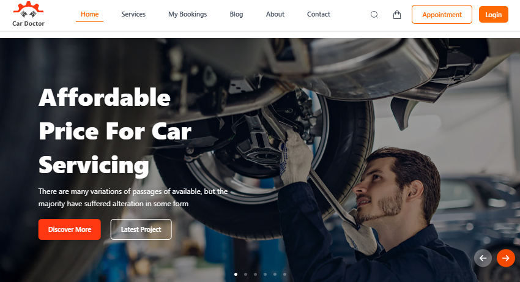

<div align="center">

<!-- Cover Image -->


<h1 style="background: linear-gradient(90deg, #22c55e, #16a34a, #15803d); -webkit-background-clip: text; -webkit-text-fill-color: transparent; font-size: 3.2em; font-weight: 900; margin: 10px 0;">
  Car Doctor
</h1>

<p><strong>🔧 One‑Stop Car Service, Booking & Auto‑Product Platform</strong></p>

<!-- Tech Badges -->
<p>
  
  
  
  
</p>
<p>
  
  
  
</p>

<!-- Live Demo Badge -->
<div style="margin: 20px 0;">
  <a href="https://car-doctor-roan.vercel.app">
    
  </a>
</div>

</div>

---

### 🚗 About Car Doctor

> **Car Doctor** is a modern **car servicing & auto‑product marketplace** built with Next.js, Tailwind, and MongoDB.  
> Users can:
> - Buy different types of car instruments and accessories.  
> - Book car‑service slots by choosing date and time.  
> - Read **tips & tricks** in the blog section to keep their cars in top condition.  

Perfect for car‑service shops or auto‑parts stores that want a **booking‑enabled shop front**.

---

## 🌟 Key Features

| ✅ Feature | 🎯 Benefit |
|----------|-----------|
| 🚘 **Service Booking System** | Customers book their car‑service time with date and time picker |
| 🛠️ **Auto‑Products Shop** | Buy car‑instruments, tools, and accessories online |
| 📚 **Blog Section (Tips & Tricks)** | Educative posts for car owners and enthusiasts |
| 🔐 **User Auth (NextAuth)** | Secure login and role‑based flows |
| 📱 **Fully Responsive** | Works smoothly on mobile, tablet, and desktop |

---

## 🌐 Live Demo

<p align="center">
  <a href="https://car-doctor-roan.vercel.app">
    
  </a>
</p>

✅ Quick flow:  
1. Browse car‑services or products  
2. Choose slots or add items to cart  
3. Login / register  
4. Place booking or order  
5. Check status in dashboard / profile

---

## 🧪 Tech Stack

### Frontend & Framework
- Next.js (App Router)  
- React 19  
- TypeScript  
- Tailwind CSS + DaisyUI (for UI components)  
- Next/font (Geist / Vercel font)  

### Data & Backend
- MongoDB (via `mongodb` driver)  
- MongoDB can later be wrapped with your own API routes or a separate backend if needed  

### Authorization & UX
- `next-auth` – Authentication & session management  
- `bcrypt` – Hashing sensitive data  
- `react-hot-toast` – Beautiful notifications  
- `react-icons` – Icon components  
- `react-rating` – Rating UI for services/reviews  

### UI Enhancements
- `react-responsive-carousel` – Responsive image carousels  
- `react-slick` + `slick-carousel` – Sliders and banners  
- DaisyUI + Tailwind utilities for clean, modern design  

---

## 📁 Project Structure (App Router)

```text
src/
├── app/               # Main application routes & logic
│   ├── about/         # About page
│   ├── api/           # API routes (auth, bookings, services, etc.)
│   ├── blog/          # Blog section routes
│   ├── checkout/      # Checkout logic for [id]
│   ├── components/    # Page-specific components
│   ├── contact/       # Contact page
│   ├── login/         # Login page
│   ├── my-bookings/   # User booking history
│   ├── popularProducts/# Product-related components
│   ├── register/      # Registration page
│   ├── services/      # Service pages
│   ├── globals.css    # Global styles
│   ├── layout.js      # Root layout
│   └── page.js        # Home page
├── components/        # Shared/Reusable UI components
├── lib/               # Database/Helper libraries (e.g., MongoDB client)
└── Providers/         # Context providers (e.g., AuthProvider, ThemeProvider)
```

---

## 🛠️ Clone from GitHub

```bash
git clone https://github.com/tuhin360/car-doctor.git
cd car-doctor
```

---

## 📦 Install Dependencies

```bash
npm install
# or
yarn
# or
pnpm install
# or
bun install
```

---

## ▶️ Run the Development Server

```bash
npm run dev
# or
yarn dev
# or
pnpm dev
# or
bun dev
```

Then open [http://localhost:3000](http://localhost:3000) in your browser.

> **Note:** This project uses Next.js with Turbopack (`next dev --turbopack`), so builds are fast in development.

---

## 🔑 Environment Variables

Create a `.env.local` file and add your configuration here (example):

```env
# Database
MONGODB_URI=your_mongodb_connection_string

# Authentication (NextAuth)
NEXTAUTH_SECRET=your_random_secret_string

# OAuth Providers
GOOGLE_CLIENT_ID=your_google_client_id
GOOGLE_CLIENT_SECRET=your_google_client_secret

GITHUB_ID=your_github_client_id
GITHUB_SECRET=your_github_client_secret
```

(Add your real secrets only in local or secure environment management.)

---

## 🚀 Future Improvements

- 🧾 Invoicing & payment for services (Stripe / other gateways)  
- 📊 Dashboard to track bookings & product sales  
- 👨‍🔧 Mechanic / team profile & slot management  
- 📱 Mobile‑optimized booking & status tracking  

---

## 👨‍💻 Author

**Jahedi Alam Tuhin**  
GitHub: [https://github.com/tuhin360](https://github.com/tuhin360)

---

## ⭐ Support

If you like this project, give it a ⭐ on GitHub!


